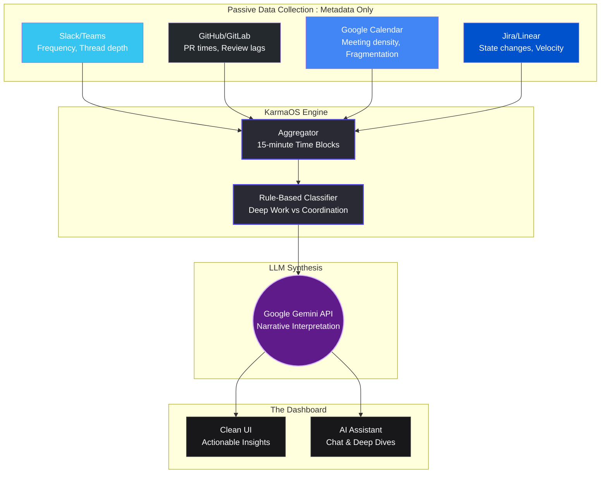

# KarmaOS 
**The Intelligence System for Modern Teams**

[](#)
[](#)
[](#)
[](#)
</div>

---

## 🧠 What is KarmaOS?

Most productivity tools measure **activity**—keystrokes, hours logged, or messages sent. KarmaOS is different. It measures **impact** and **friction**. 

By passively reading *metadata* across your tools (Slack, GitHub, Calendar, Jira) and applying intelligent classification and LLM reasoning via **Google Gemini**, KarmaOS turns raw signals into clear, actionable human narratives. 

Instead of showing you a complex dashboard of charts, it simply tells you: *"Good morning. Your team is highly focused today, but engineering is currently blocked on design approvals for the new checkout flow."*

---

## ✨ Core Philosophy

| Core Principle | How KarmaOS Delivers |
| --- | --- |
| **Meaning Over Metrics** | Synthesizes complex data points into a single, understandable narrative statement. |
| **Passive Measurement** | Requires zero behavioral change. No timers, no forms, no manual status updates. |
| **Proactive Insight** | Identifies bottlenecks and overload risks *before* they turn into missed deadlines or team burnout. |
| **Privacy First** | Reads metadata only (timestamps, thread length, context switches) — never reads your private message content. |

---

## 🏗️ System Architecture

KarmaOS is more than just a dashboard; it is a meticulously structured data pipeline that processes metadata into meaning. 



### How the Data Flows:
1. **Aggregates metadata** events into 15-minute chronological blocks.
2. **Classifies** those blocks into distinct states (*Deep Work*, *Shallow Coordination*, *Friction*).
3. **Prompts Gemini** with aggregated statistical summaries.
4. **Renders** Gemini's narrative outputs to managers in a high-signal, zero-anxiety UI.

---

## ⚡ Getting Started 

> [!IMPORTANT]  
> To run the complete mock app and utilize the AI assistant, ensure you have set up your GEMINI API credentials.

### Prerequisites
- [Node.js](https://nodejs.org/en/) (v18+)

### Installation & Setup

1. **Install dependencies:**
   ```bash
   npm install
   ```

2. **Configure Environment Variables:**
   Rename `.env.example` to `.env.local` or edit `.env.local` directly and add your API key:
   ```env
   GEMINI_API_KEY=your_gemini_api_key_here
   ```

3. **Start the Development Server:**
   ```bash
   npm run dev
   ```

> [!TIP]  
> View your original app generation and logs in [AI Studio](https://ai.studio/apps/0c48ce4b-17f6-4c4d-b456-b195c7719db0).

---

## 🛠️ Tech Stack

- **Frontend**: React 18, Vite
- **Language**: TypeScript
- **Styling**: Tailwind CSS, Lucide React
- **Intelligence**: Google Gemini API
- **Data Architecture (MVP)**: Simulated Event & State Generators

> [!NOTE]  
> The current version focuses on the **MVP Scope** proving out the UI and AI interpretation loop. Hardcoded structural logic replaces complex OAuth integration flows for this early tech demonstration.
