# KarmaOS  
**The Workforce Operating System — Intelligence · Operations · Automation**

[](#)
[](#)
[](#)
[](#)
[](#)
</div>

---

## 🧠 What is KarmaOS?

Most productivity tools measure **activity**—keystrokes, hours logged, or messages sent. KarmaOS is different. It measures **impact** and **friction**. 

KarmaOS is a passive, zero-friction intelligence layer that reads *metadata* across your tools (Slack, GitHub, Calendar, Jira). It doesn't surveil message content—it analyzes patterns (e.g., context switching, thread density, PR review times) and correctly classifies work patterns into distinct states: **Deep Work, Shallow Work, and Coordination**.

By applying intelligent classification and LLM reasoning via **Google Gemini**, KarmaOS turns these raw metadata signals into clear, actionable human narratives. Instead of forcing you to interpret a chaotic dashboard of charts, it acts as a **thinking partner**, proactively telling you where the friction is: *"Good morning. Your team is highly focused today, but engineering is currently blocked on design approvals for the new checkout flow."*

**KarmaOS v2** extends this intelligence layer with a complete **HR Operations backbone** and an **Agentic Automation Engine**, transforming it from an analytics tool into a complete, modern workforce operating system.

---

## 🚀 Key Capabilities & Differentiation

- **Activity vs. Impact:** KarmaOS understands that 100 Slack messages could signify high team alignment, or a completely broken process. It measures the *quality* of time, not just the quantity.
- **Quantifying "Invisible Work":** KarmaOS detects workflow bottlenecks that happen between tools (e.g., a ticket that sits in review while 50 Slack messages are exchanged about it), pinpointing systemic friction rather than blaming individuals.
- **Zero-Friction Passive Intelligence:** No timers, no forms, no status updates. KarmaOS operates completely passively in the background, requiring absolutely zero behavioral changes from your team.
- **Proactive Burnout Prevention:** By tracking context switching and after-hours coordination, KarmaOS can objectively identify overload risks *before* burnout occurs, shifting management from reactive to proactive.
- **Synthesized AI Narratives, Not Fake Charts:** We strictly avoid "Fake AI." Models aren't used to draw charts or tally numbers. We use deterministic algorithms for classification, and rely on Gemini *exclusively* for synthesis—taking disparate data points and telling the objective human story behind them.

---

## ✨ Core Features

### 🔍 Intelligence Layer
| Feature | Description |
|---|---|
| **System Overview** | Daily narrative-driven dashboard with AI-synthesized workforce insights |
| **Recruiter Agent** | Automated candidate sourcing, screening, and Work DNA matching |
| **Team Insights** | Performance analysis across departments with deep work metrics |
| **Work DNA Profiles** | Per-employee behavioral classification (Maker, Synchronizer, Operator) |
| **AI Assistant** | Conversational interface powered by Gemini for deep-dive queries |

### 🏢 HR Operations
| Feature | Description |
|---|---|
| **Leave Management** | Apply, approve/reject, balance tracking with sick/casual/unpaid types |
| **Attendance** | Check-in/out, working hours calculation, daily status grid |
| **Payroll Summary** | Monthly salary breakdown with unpaid leave deductions |

### ⚡ Automation Engine
| Feature | Description |
|---|---|
| **Natural Language Rules** | Describe rules in plain English (e.g., *"If an employee takes more than 3 leaves in a month, flag them"*) |
| **Gemini-Powered Parsing** | AI converts prompts into structured `{condition, trigger, action}` rules |
| **Visual Workflow** | React Flow pipeline visualization (Data Source → Trigger → Condition → Action → Output) |
| **Live Evaluation** | One-click rule execution against live workforce data |

### 🔎 Hiring Automation
| Feature | Description |
|---|---|
| **Prompt-Based Sourcing** | Describe your ideal candidate — Gemini parses it into structured hiring filters |
| **LinkedIn + Naukri Scraping** | Simulated web scraping from both platforms with source badges |
| **Manual Filter Editing** | Fine-tune AI-generated rules via modal (experience, skills, location, exclusions) |
| **Candidate Pipeline** | Shortlist/reject candidates, view match scores, Work DNA compatibility |

### 🔌 Integrations
| Provider | Data Points |
|---|---|
| **Slack** | Channel activity, message frequency, response time, focus hours |
| **Microsoft Teams** | Meeting frequency, chat activity, org structure, calendar data |
| **Microsoft Outlook** | Email volume, calendar density, response patterns, meeting conflicts |
| **Discord** | Server activity, voice participation, thread engagement, sentiment |
| **Google Workspace** | Gmail volume, calendar events, Drive activity, Meet usage |

> Integrations connect in-app with simulated OAuth flow (localStorage-persisted). For production Outlook, register an Azure AD app with `Mail.Read` + `Calendars.Read` Graph API permissions.

---

## 🏗️ System Architecture

```mermaid
graph TD
    subgraph Data Sources
        S[Slack/Teams]
        G[GitHub/GitLab]
        C[Calendar/Outlook]
        J[LinkedIn/Naukri]
        HR[HR Data<br>Leave, Attendance]
    end

    subgraph KarmaOS Engine
        A[Aggregator<br>15-min Blocks]
        ML[Classifier<br>Deep Work vs Coordination]
        RE[Rule Engine<br>Automation Rules]
        HA[Hiring Engine<br>Candidate Matching]
    end

    subgraph Intelligence Layer
        LLM((Google Gemini<br>Narrative + Parsing))
    end

    subgraph User Experience
        UI[Dashboard<br>Insights & Operations]
        AI[AI Assistant<br>Conversational]
        RF[React Flow<br>Visual Workflows]
    end

    S --> A
    G --> A
    C --> A
    J --> HA
    HR --> RE

    A --> ML
    ML --> LLM
    RE --> LLM
    HA --> LLM
    LLM --> UI
    LLM --> AI
    LLM --> RF

    style S fill:#36C5F0,stroke:#none,color:#fff
    style G fill:#24292e,stroke:#none,color:#fff
    style C fill:#0078D4,stroke:#none,color:#fff
    style J fill:#0A66C2,stroke:#none,color:#fff
    style HR fill:#10b981,stroke:#none,color:#fff
    style A fill:#2A2A35,stroke:#4f46e5,color:#fff,stroke-width:2px
    style ML fill:#2A2A35,stroke:#4f46e5,color:#fff,stroke-width:2px
    style RE fill:#2A2A35,stroke:#f59e0b,color:#fff,stroke-width:2px
    style HA fill:#2A2A35,stroke:#3b82f6,color:#fff,stroke-width:2px
    style LLM fill:#5E1B89,stroke:#d8b4fe,color:#fff,stroke-width:2px
    style UI fill:#18181B,stroke:#3f3f46,color:#fff
    style AI fill:#18181B,stroke:#3f3f46,color:#fff
    style RF fill:#18181B,stroke:#FF0072,color:#fff,stroke-width:2px
```



### Data Flow
1. **Aggregates** metadata events into 15-minute chronological blocks
2. **Classifies** blocks into distinct states (Deep Work, Shallow Coordination, Friction)
3. **Prompts Gemini** with aggregated summaries — narratives for insights, structured JSON for automation/hiring rules
4. **Evaluates** automation and hiring rules against live workforce + HR data
5. **Renders** everything in a premium, narrative-first UI

---

## ⚡ Getting Started 

> [!IMPORTANT]  
> A `GEMINI_API_KEY` is required for all AI features (dashboard insights, automation rule parsing, hiring rule creation, AI assistant).

### Prerequisites
- [Node.js](https://nodejs.org/en/) (v18+)

### Installation & Setup

1. **Install dependencies:**
   ```bash
   npm install
   ```

2. **Configure Environment Variables:**
   Create or edit `.env.local` and add your API key:
   ```env
   GEMINI_API_KEY=your_gemini_api_key_here
   ```

3. **Start the Development Server:**
   ```bash
   npm run dev
   ```
   The app will be available at `http://localhost:3000`.

> [!TIP]
> If port 3000 is busy, run `npx kill-port 3000` before starting the server.

---

## 📁 Project Structure

```
├── server.ts                    # Express server — all APIs, Gemini calls, in-memory stores
├── src/
│   ├── App.tsx                  # Routing (12 routes)
│   ├── main.tsx                 # Entry point with ThemeProvider
│   ├── index.css                # Design system + dark mode variables
│   ├── contexts/
│   │   ├── AuthContext.tsx       # Firebase auth wrapper
│   │   └── ThemeContext.tsx      # Dark mode toggle (localStorage-backed)
│   ├── layouts/
│   │   └── DashboardLayout.tsx  # Sidebar nav, search, theme toggle
│   ├── pages/
│   │   ├── Dashboard.tsx        # System overview with AI insights
│   │   ├── TalentIntelligence.tsx  # Recruiter agent
│   │   ├── HiringAutomation.tsx # LinkedIn/Naukri sourcing rules
│   │   ├── TeamInsights.tsx     # Performance analysis
│   │   ├── EmployeeView.tsx     # Individual Work DNA profile
│   │   ├── LeaveManagement.tsx  # Leave apply/approve flow
│   │   ├── Attendance.tsx       # Check-in/out grid
│   │   ├── Automation.tsx       # React Flow workflow builder
│   │   ├── Settings.tsx         # Profile + integrations
│   │   └── LandingPage.tsx      # Public landing
│   ├── components/
│   │   └── AiAssistant.tsx      # Floating chat widget
│   └── lib/
│       ├── dataService.ts       # All API fetch wrappers (30+ functions)
│       ├── gemini.ts            # Client-side Gemini helpers
│       ├── firebase.ts          # Firebase config
│       └── utils.ts             # cn() class merge utility
├── data/
│   └── Employee_Data.xlsx       # Source employee dataset
└── .env.local                   # GEMINI_API_KEY
```

---

## 🛠️ Tech Stack

| Layer | Technology |
|---|---|
| **Frontend** | React 18, Vite, Framer Motion |
| **Language** | TypeScript (strict mode) |
| **Styling** | Tailwind CSS, Lucide React icons |
| **Intelligence** | Google Gemini 2.5 Flash API |
| **Workflow Viz** | React Flow (@xyflow/react) |
| **Server** | Express.js (custom dev server) |
| **Auth** | Firebase Authentication (optional) |
| **Data** | In-memory stores (MVP), Excel source data |

---

## 🔐 Security Model

- **Gemini API key** is server-side only — never exposed to the browser
- All AI calls routed through Express endpoints in `server.ts`
- Firebase auth gates dashboard access when configured
- Integration tokens stored in localStorage (simulated OAuth for MVP)

---

## 📝 MVP Notes

> [!NOTE]  
> All HR data (leave, attendance, payroll) and automation rules are stored **in-memory** and reset on server restart. This is intentional for the MVP — the architecture cleanly separates data stores for easy database migration.

> [!NOTE]  
> LinkedIn/Naukri scraping is **simulated** with 20 seeded Indian tech market profiles. The API structure is production-ready for plugging in real scraping services (Proxycurl, RapidAPI, etc.).

---

## 🗺️ Roadmap

- [ ] Persistent database (PostgreSQL/MongoDB)
- [ ] Real OAuth flows for Slack, Teams, Outlook
- [ ] Live LinkedIn/Naukri API integration
- [ ] Scheduled automation rule execution (cron)
- [ ] Email/Slack notification delivery for triggered rules
- [ ] Role-based access control (Admin, Manager, Employee)
- [ ] Employee self-service portal (own leave/attendance)
